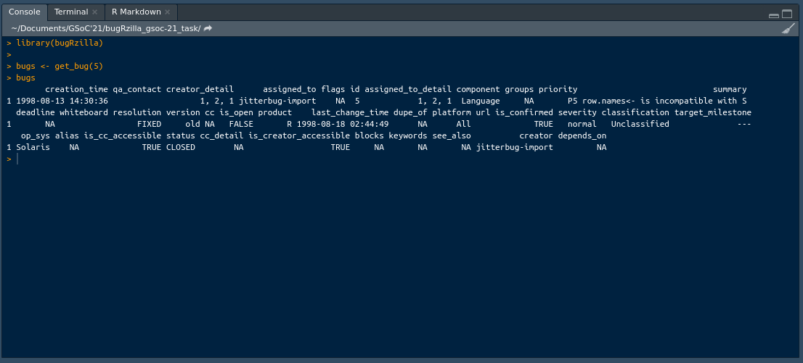

# Task-1
### Find the first 5 issues posted on Bugzilla. This can be done with the package or through Bugzilla (Check familiarity with bugRzilla code and Bugzilla)
> I've used the bugRzilla library. Used a get_bug() function, this function works as it only returns a single issue corresponding to the value passed (i.e. the id of issue) in the function. So, I used a for loop to iterate over the get_bug() function but there was a problem as the get_bug() function throws an error that "Bug #issue does not exist.", e.g. "Bug #2 does not exist." in that situation, the aim was to continue the for loop and skip the error, so I used trycatch() function to continue the loop to find the first 5 issues posted on Bugzilla.

