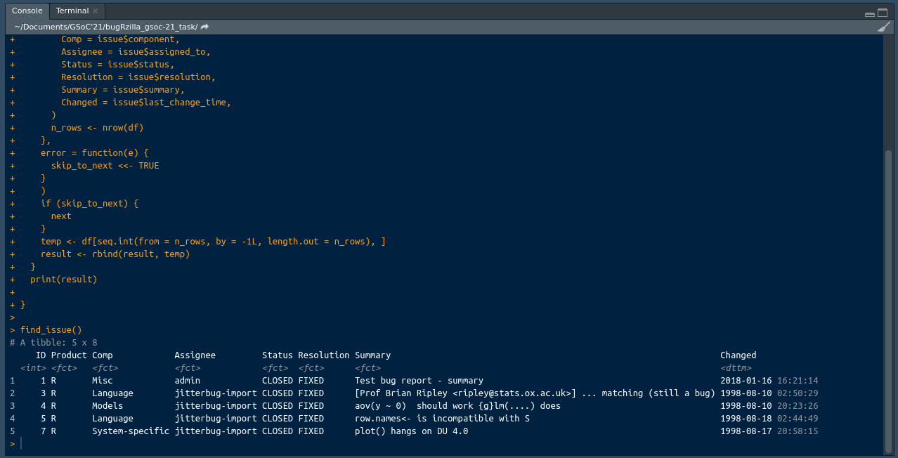

# Task-1
### Find the first 5 issues posted on Bugzilla. This can be done with the package or through Bugzilla (Check familiarity with bugRzilla code and Bugzilla)
> I've used bugRzilla library. Used a get_bug() function, this fucntion works as it only returns a single issue corresponding to the the value passed in the function. So, I used a for to iterate over the for loop but there was a problem as get_bug() function throws an error that **Bug #issue not forund** in that situation the aim was to continue the for loop and skip the error, so I used trycatch() function to continue the loop.

