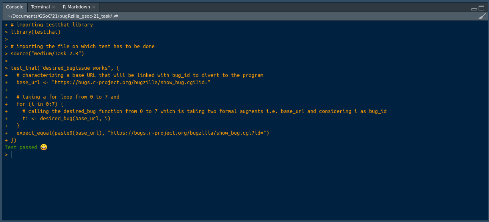

# Task-2
### Create a function that opens on the browser a desired bug report on Bugzilla. Create some tests for the function. (Level of technical skills)
> In this, I've imported bugRzilla library. Created a function desired_bug() in which I used the browseURL() fucntion and concatenated the formal arguments i.e. url and id. In the test file, I've imported the Task-2 file where I've created the deseired_bug() fucntion. In test file, I've defined the base_url and used a for loop from 0 to 7 the motive of using for loop is to check for different id's this will cover the edge test_cases. For example, I took id=1 and it sucessfully showing me the bug report but if I take id=2 it should open the URL and show me the message "You must enter a valid bug number!". I've defiened the t1 variable which is used in the expect_equal() to check wheather t1 is similar as base_url with different id's.

